# Summary of TV WRI MATLAB Code

##  Included files

### Main Script and Functions

1. main.m
2. setup_problem.m
3. pTV.m
4. convex_sub.m

### Additional Functions

1. getDiscreteLap.m
2. generateData.m
3. getDiscreteGrad.m
4. proj_TVbounds.m
5. vsmooth.m
6. figadust.m
7. make_movie.m


## Structure of Code and Summary of Algorithm

The main script is `main.m` and can be run by typing `main` at the MATLAB prompt.  It calls 
	
    [model,pm,Ps,Pr,q,d,ssW] = setup_problem(example);

to define a struct of model parameters, `model`, a struct of algorithm parameters, `pm`, sampling operators `Ps` and `Pr` that project onto source and receiver locations respectively, Fourier coefficients of the source wavelet `q` at the sampled frequencies and a cell structure of data, `d`, such that `d{v}` is a frequency slice of data at the frequency indexed by `v`.  It also defines a matrix of weights `ssW` that can be used to blend sources and data to simulate simultaneous shots.

A detailed description of the total variation regularized Wavefield Reconstruction Inversion method can be found in the technical report at <a href="https://slim.gatech.edu/content/scaled-gradient-projection-method-total-variation-regularized-full-waveform-inversion">https://slim.gatech.edu/content/scaled-gradient-projection-method-total-variation-regularized-full-waveform-inversion</a> and the SINBAD presentation at <a href="https://slim.gatech.edu/content/scaled-gradient-projection-method-total-variation-regularized-full-waveform-inversion-0">https://slim.gatech.edu/content/scaled-gradient-projection-method-total-variation-regularized-full-waveform-inversion-0</a>.  Briefly, it is minimizing a constrained quadratic penalty objective for acoustic full waveform inversion that has the form
```math #QP
\min_m F(m) \qquad \text{s.t.} \qquad m_i \in [b_i , B_i] \text{ and } \|m\|_{TV} \leq \tau \ .
```
where
```math #F
F(m) = \sum_{sv}F_{sv}(m)
```
and
```math #Fsv
F_{sv}(m) = \frac{1}{2}\|P \bar{u}_{sv}(m) - d_{sv}\|^2 + \frac{\lambda^2}{2}\|A_v(m)\bar{u}_{sv}(m) - q_{sv}\|^2 \ .
```
This nonconvex objective is a sum of squares of data misfits and PDE misfits in the frequency domain, summed over source indices ``s`` and frequency indices ``v``.  

A candidate initial model `minit` is defined in `setup_problem.m`, but if it doesn't satisfy the bound and TV constraints, it is projected onto the nearest model that does by calling the function `proj_TVbounds.m`.

    minit = proj_TVbounds(minit,.99*pm.tau,model.h,pm.dpw,model.mmin,model.mmax);

The resulting initial model is stored in a 3D matrix `mb` that will eventially contain the models (slowness squared) that are estimated after each small batch of frequency data moving from low to high frequencies in overlapping batches.

    mb(:,:,1) = minit; 

For each frequency batch `b`, only a subset of frequency indices `Vb` are used so that the objective we work with is defined by 
```math #FVb
F(m) = \sum_{s,v \in V_b}F_{sv}(m)
```
The result from the previous batch `mb(:,:,b)` is used as a warm start when solving the problem on the next frequency batch for `mb(:,:,b+1)`.  This procedure is carried out in `main.m` with the loop

    for b = 1:model.batches
        [mTV,energy,oits,cinit] = pTV(model,pm,b,mb(:,:,b),Ps,Pr,q,d,ssW,cinit);
        mb(:,:,b+1) = mTV;
	end

The function `pTV.m` solves ([#FVb]) by a sequence of outer iterations of the form
```math #pTVb
\dm & = \arg \min_{\dm} \dm^T \nabla F(m^n) + \frac{1}{2}\dm^T (H^n + c_n\I) \dm  \\
& \text{s.t. } m^n_i + \dm_i \in [b_i , B_i] \text{ and } \|m^n + \dm\|_{TV} \leq \tau \\
m^{n+1} & = m^n + \dm \ .
```
At the current model estimate ``m^n``, it uses the gradient ``\nabla F(m^n)`` and a diagonal Gauss Newton approximation to the Hessian ``H_n`` to construct a quadratic approximation to the objective, which can then be minimized subject to the bound and TV constraints to get a model update ``\dm``.

Inside `pTV.m` is a function `computeGradient()`, which computes the objective, the gradient and the Gauss Newton Hessian via

    [obj,g,H] = computeGradient(m,model,pm,Q,ssW,Ps,Pr,freq_ind,freq,q,d);

The convex subproblems for ``\dm`` are solved by an iterative primal dual method defined in the function `convex_sub()`, which is called by `pTV.m` during every outer iteration via 

    dm = reshape(convex_sub(model,pm,m,g,Hc),n(1),n(2));

At the end of `main.m`, the sequence of model estimates stored in `mb` can be used to make a movie of the algorithm's progress by

    make_movie 
    movie(99,velocity_movie,1,4);


## How to Modify Code to Run Different Examples

Two included examples can be run by typing `main` at the  MATLAB prompt.  In `main.m` set `example = 'blob'` to run a simple example based on a synthetic velocity model that has a high velocity blob against a smooth background velocity that increases linearly with depth.  This model is defined in `setup_problem.m` and does not require any additional data to be downloaded.  Set `example = 'BPC'` to use a downsampled portion of the BP 2004 Velocity Benchmark data set as the true velocity model.

Additional examples can be defined in `setup_problem.m`, which is currently organized as a switch statement

    switch example    
        case {'blob'}
			%sets up parameters and data for blob example
	    case {'BPC'} 
			%sets up parameters and data for BP example
	end

More examples can be included as additional cases.  The following parameter, data and functions are defined in `setup_problem(example)`

* `model.example = example`
* `model.h` -- mesh width in meters
* `model.n` -- model dimensions, depth by width
* `model.N` -- total number of model parameters (defined by `prod(n)`)
* `model.zt = 0:h:h*(n(1)-1)` -- ``z`` coordinates
* `model.xt = 0:h:h*(n(2)-1)` -- ``x`` coordinates
* `model.vtrue` -- define to be true velocity model
* `model.vinit` -- define to be initial velocity model
* `model.vmin` -- minimum velocity (same dimension as model)
* `model.vmax` -- maximum velocity (same dimension as model)
* `model.mtrue = 1./model.vtrue.^2`
* `model.minit = 1./model.vinit.^2`
* `model.mmin = 1./model.vmax.^2`
* `model.mmax = 1./model.vmin.^2`
* `model.freq` -- list of sampled frequencies (Hz)
* `model.nf` -- number of frequencies used
* `model.Vb` -- each row defines a frequency batch by specifying the indices into `model.freq` to be used in that batch
* `model.batches = size(model.Vb,1)`
* `model.f0` -- peak frequency of source wavelet, assumed here to be a Ricker wavelet
* `model.t0` -- phase shift of source wavelet in seconds
* `model.zsrc` -- ``z`` coordinates of source locations
* `model.xsrc` -- ``x`` coordinates of source locations
* `model.ns` -- number of sources
* `model.zrec` -- ``z`` coordinates of receiver locations
* `model.xrec` -- ``x`` coordinates of receiver locations
* `model.nr` -- number of receivers
* `q` -- Fourier coefficients of the source wavelet at the sampled frequencies
* `model.vweights` -- optional frequency dependent weights to scale each ``F_{sv}(m)`` component of the objective
* `model.nsim` -- number of simultaneous shots
* `model.redraw` -- `1` to randomly redraw weights, `0` for no redraws
* `model.rngshots = rng('shuffle')` -- store seed for random number generator
* `ssW` --  matrix of weights that can be used to blend sources and data to simulate `model.nsim` simultaneous shots.  If `model.redraw = 1`, these are redrawn from a Gaussian distribution every time the model is updated.  If `model.redraw = 0`, the weights in `ssW` don't change.  The case of sequential shots corresponds to setting `model.nsim = ns`, `model.redraw = 0` and `ssW = speye(ns,model.nsim)`.
* `Ps` and `Pr` -- sampling operators that project onto source and receiver locations.  Their definitions currently assume that these locations correspond to points in the discretization.
* `model.Xint` and `model.Xbnd` -- masks used in defining the absorbing boundary condition, which here is a simple Robin boundary condition
* `model.L` -- Discrete Laplacian defined by `L = getDiscreteLap(n,h)`, which uses a simple ``5`` point stencil
* `model.rngnoise = rng('shuffle')` -- store seed for random number generator
* `model.dsig` -- if nonzero, then frequency dependent Gaussian random noise is added to the data with standard deviation `model.dsig/sqrt(model.ns*model.nr)` times the norm of each frequency slice of data `d{v}`
* `model.M = @(ff,mm) (2*pi*ff)^2*spdiags(model.Xint(:).*mm(:),0,N,N) - ...`
   `1i*(2*pi*ff)*spdiags(model.Xbnd(:).*sqrt(mm(:)),0,N,N)` -- this function of frequency and model is used in the definition of the Helmholtz operator `L + M`
* `d` -- data defined by `generateData(model,q,Ps,Pr)`
* `model.D` and `model.E` are defined by `[D,E] = getDiscreteGrad(n(1),n(2),h,pm.dpw)` and used to define the TV constraint
* `pm.dpw` -- optional depth weights to make the strength of the TV penalty depth dependent.  Should be a vector of length `model.n(1)` with values between ``0`` and ``1``.
* `pm.TV = @(t) sum(sqrt(E'*((D*t(:)).^2)))` -- function for evaluating the total variation of a `model.n(1)` by `model.n(2)` image.
* `pm.mu` -- numerical parameter that doesn't change objective but can affect rate of convergence.  OK to set to ``1``.
* `pm.lambda` -- penalty parameter for PDE misfit
* `pm.tau` -- parameter for total variation constraint.  The total variation of the true model is `pm.TV(model.mtrue)`
* `pm.cmin` and `cmax` -- bounds on an adaptive parameter for damping the Hessian 
* `pm.c1` -- factor to decrease c if objective is decreasing enough
* `pm.c2` -- factor to increase c if objective doesn't decrease enough
* `pm.sigma` -- what fraction of ideal objective decrease is acceptable
* `pm.itol` -- tolerance for inner iteration stopping condition
* `pm.miniits` -- minimum number of inner iterations
* `pm.maxiits` -- maximum number of allowed inner iterations
* `pm.admax = h^2/8` -- lower bound for ``\frac{1}{\|D^TD\|}``, used to define convex subproblem parameters
* `pm.otol` -- tolerance for outer iteration stopping condition
* `pm.maxoits` -- maximum number of allowed outer iterations
* `pm.minoits = min(2,pm.maxoits)` -- minimum number of outer iterations

## Results for Included Examples

For the blob example, the true model, source and receiver locations and initial model are shown in Figure [#blob_setup].

### Figure: {#blob_setup}
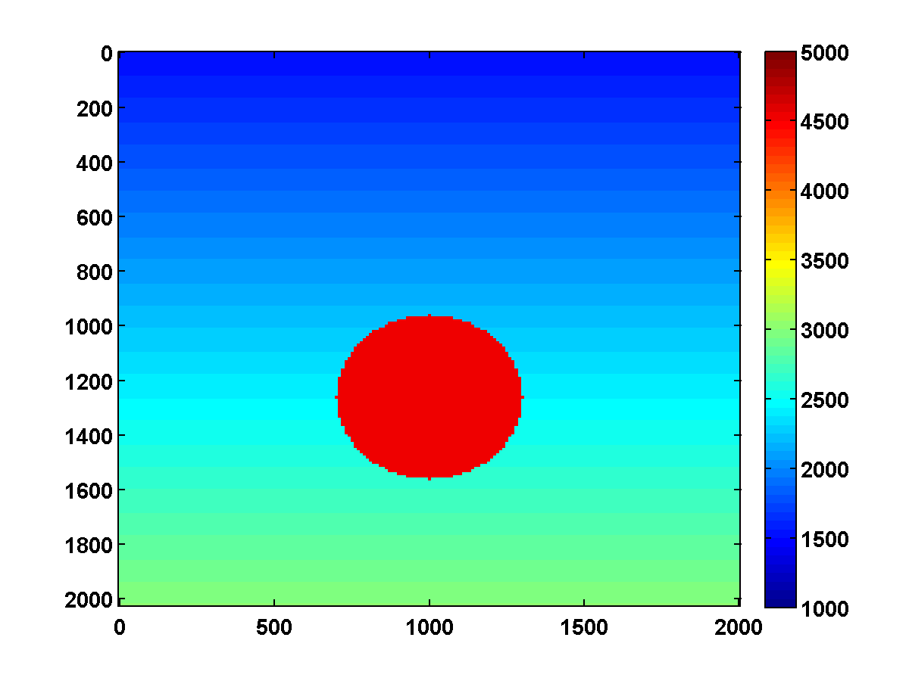{width=33% #fig:blob_vtrue}
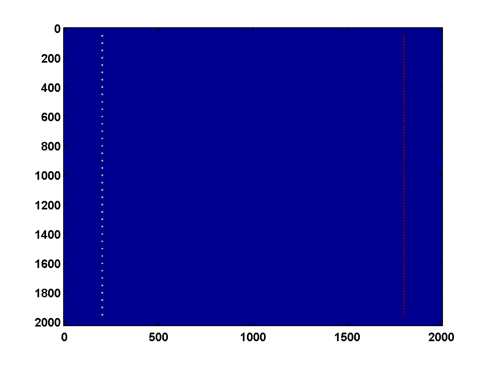{width=33% #fig:blob_src_rec}
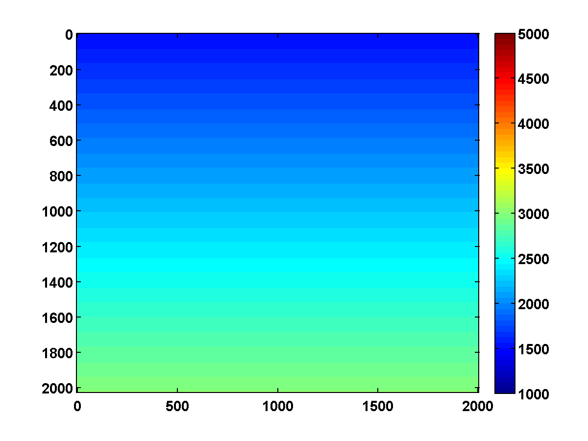{width=33% #fig:blob_vinit}
Synthetic velocity model (a), source and receiver locations (b) and initial velocity (c).

The results with ``\tau = 1000||m_{\text{true}}|_{TV}`` and ``\tau = .875||m_{\text{true}}|_{TV}`` are shown in Figure [#blob_results].  Both examples use noisy data corresponding to `model.dsig = .05`.

### Figure: {#blob_results}
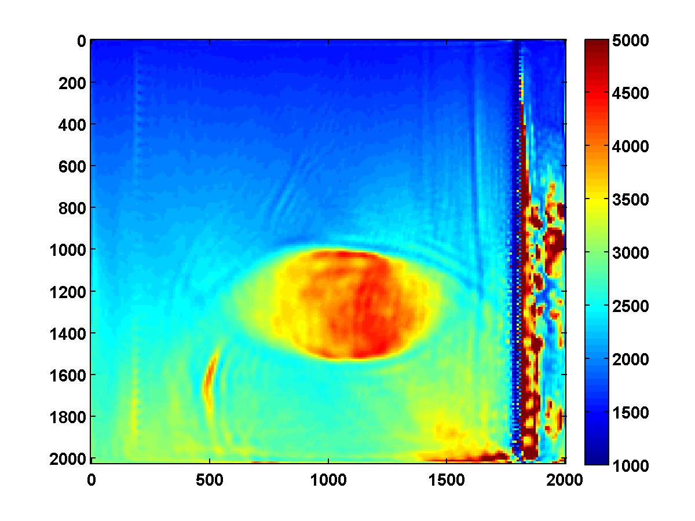{width=48% #fig:blobtaularge}
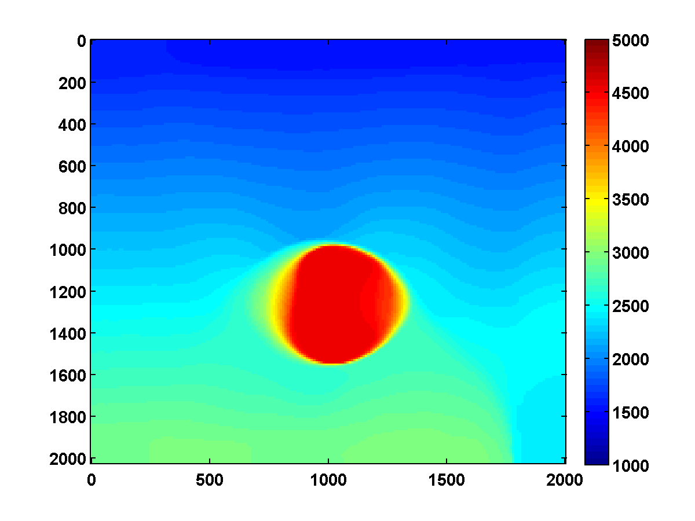{width=^}
Results for ``\tau = 1000\tau_{\text{true}}`` (a) and ``\tau = .875\tau_{\text{true}}``  (b)

A comparison of their relative model errors are shown in Figure [#blob_model_error].

### Figure: {#blob_model_error }
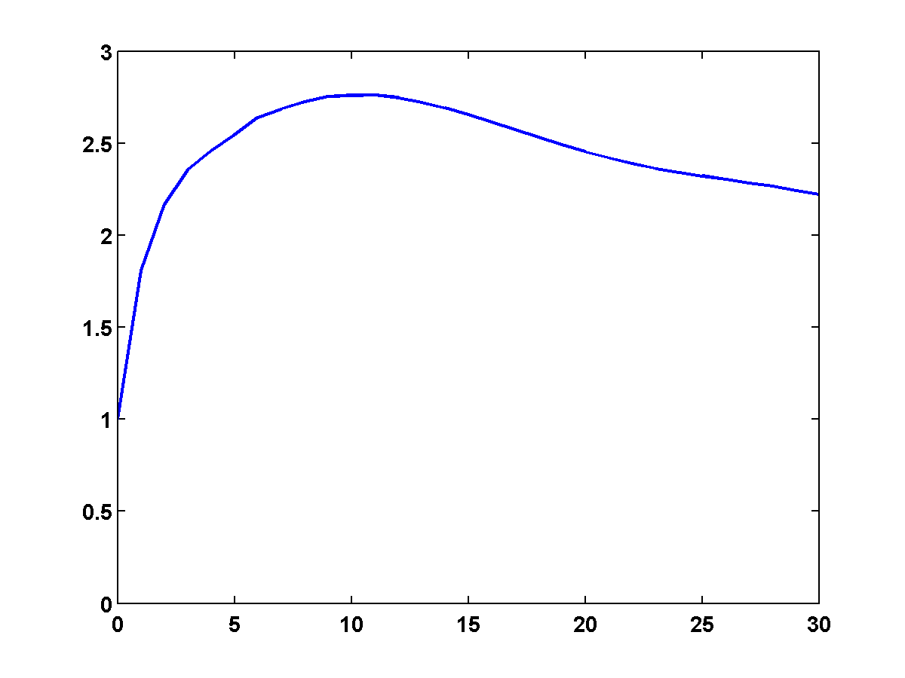{width=33% #blob_model_error_a} 
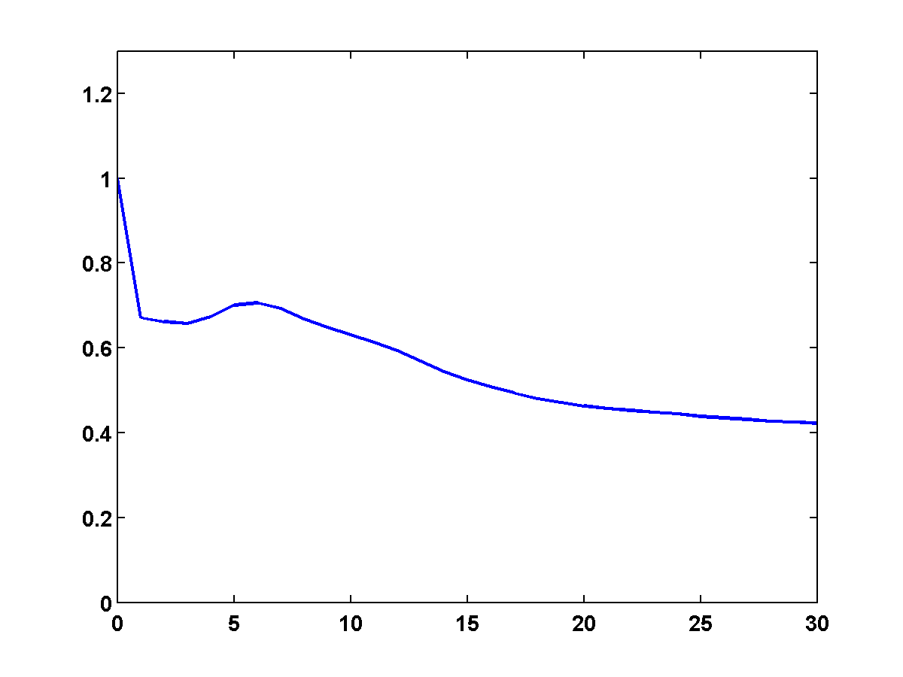{width=33% #blob_model_error_b}
Relative model error versus frequency batch with bound constraints (a), and with bound and TV constraints (b).

For the BP example, the true model, source and receiver locations and initial model are shown in Figure [#BPC_setup].  

### Figure: {#BPC_setup}
{width=33% #BPC_vtrue}
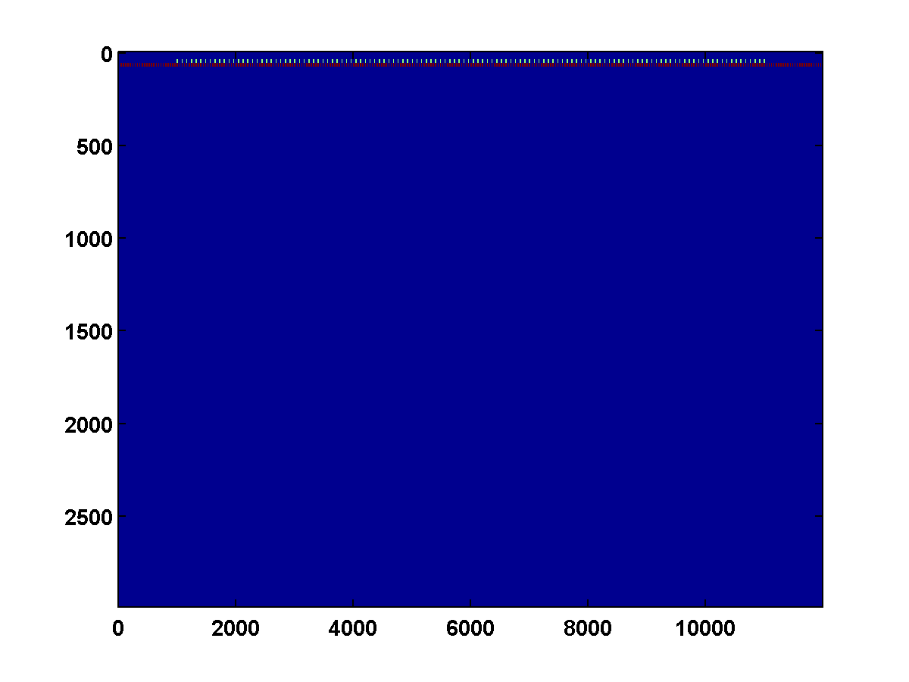{width=33% #BPC_src_rec}
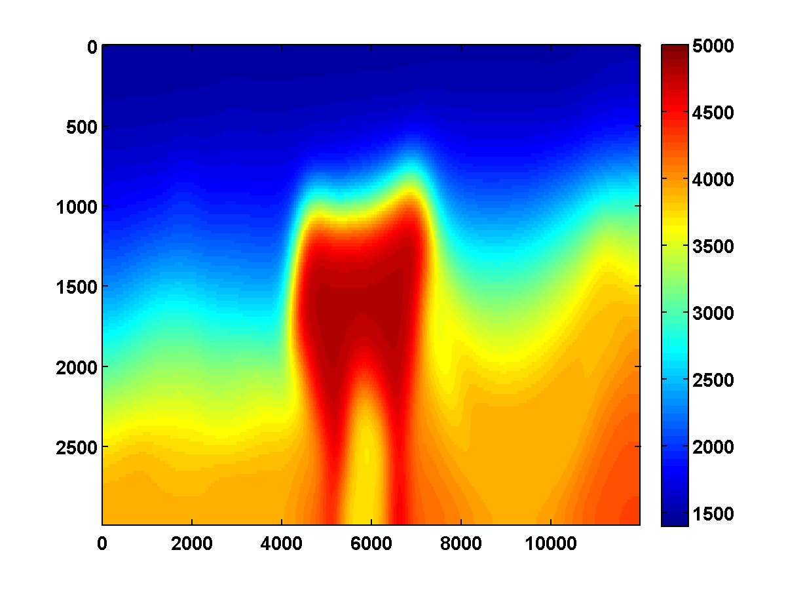{width=33% #BPC_vinit}
Top middle portion of BP 2004 velocity model (a), source and receiver locations (b) and initial velocity (c).

The results with ``\tau = 1000||m_{\text{true}}|_{TV}`` and ``\tau = .9||m_{\text{true}}|_{TV}`` are shown in Figure [#BPC_results].  Both examples use noise free synthetic data.

### Figure: {#BPC_results }
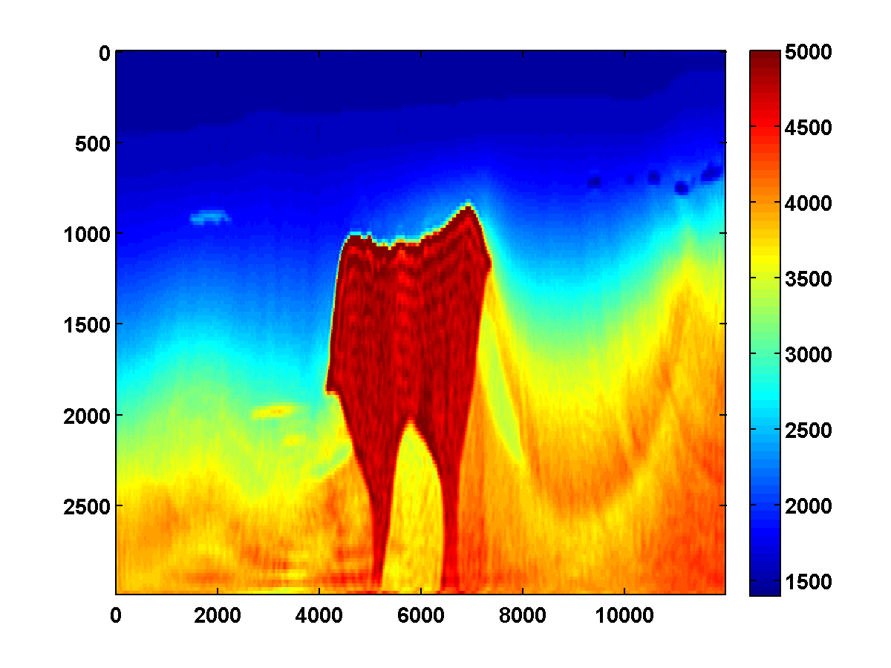{width=48% #BPC_a}
{width=^ #BPC_b}
Results for ``\tau = 1000\tau_{\text{true}}`` (a) and ``\tau = .9\tau_{\text{true}}`` (b)

A comparison of their relative model errors are shown in Figure [#BPC_model_error].

### Figure: {#BPC_model_error }
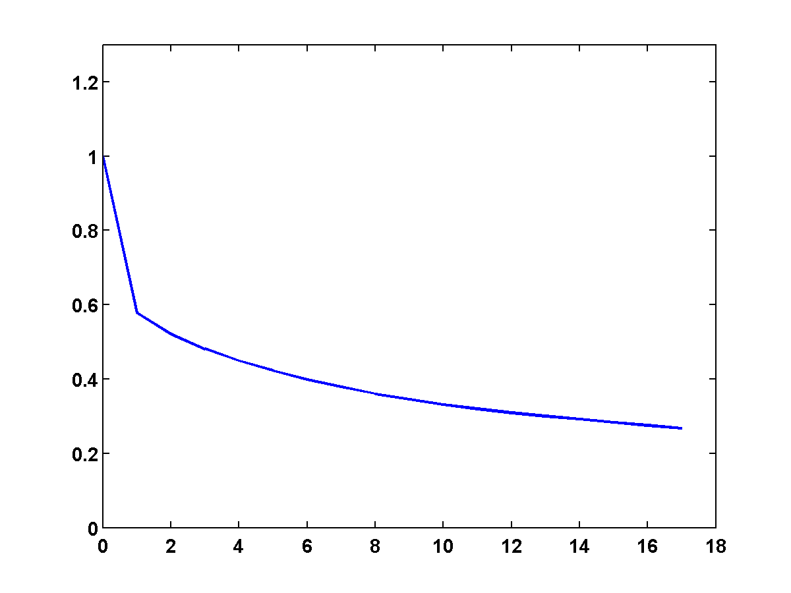{width=33% #BPC_model_error_a} 
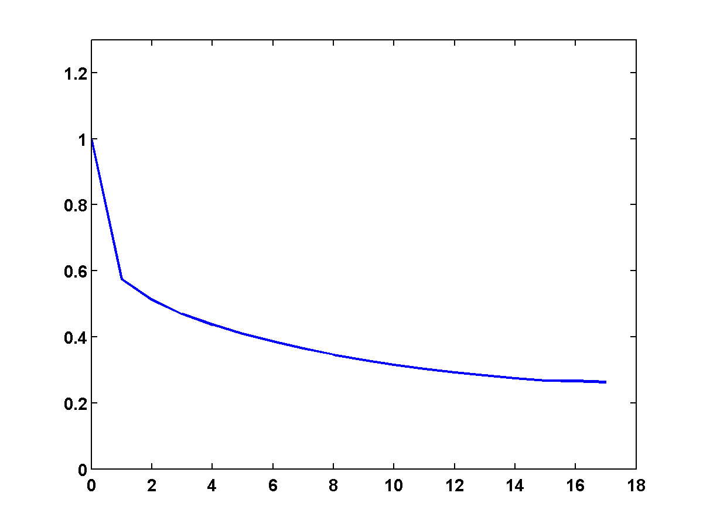{width=33% #BPC_model_error_b}
Relative model error versus frequency batch with bound constraints (a), and with bound and TV constraints (b).


```math_def
\DeclareMathOperator{\sign}{sign}
\DeclareMathOperator{\mean}{mean}
\DeclareMathOperator{\diag}{diag}
\DeclareMathOperator{\conj}{conj}
\providecommand{\re}{}
\renewcommand{\re}{\mathrm{Re}}
\providecommand{\im}{}
\renewcommand{\im}{\mathrm{Im}}
\providecommand{\I}{}
\renewcommand{\I}{\mathrm{I}}
\providecommand{\X}{}
\renewcommand{\X}{\mathcal{X}}
\providecommand{\N}{}
\renewcommand{\N}{\mathcal{N}}
\providecommand{\L}{}
\renewcommand{\L}{\mathcal{L}}
\providecommand{\R}{}
\renewcommand{\R}{\mathbb{R}}
\providecommand{\C}{}
\renewcommand{\C}{\mathbb{C}}
\providecommand{\bbm}{}
\renewcommand{\bbm}{\begin{bmatrix}}
\providecommand{\ebm}{}
\renewcommand{\ebm}{\end{bmatrix}}
\providecommand{\dm}{}
\renewcommand{\dm}{\Delta m}
\providecommand{\dt}{}
\renewcommand{\dt}{\Delta t}
\providecommand{\alg}{}
\renewcommand{\alg}[1]{\vspace{.2in} \needspace{5 \baselineskip}
\hrule \vspace{.1in} {#1} \hrule \vspace{.2in} \noindent}
\providecommand{\comments}{}
\renewcommand{\comments}[1]{}
\providecommand{\e}{}
\renewcommand{\e}[1]{\ensuremath{\times 10^{#1}}}
```